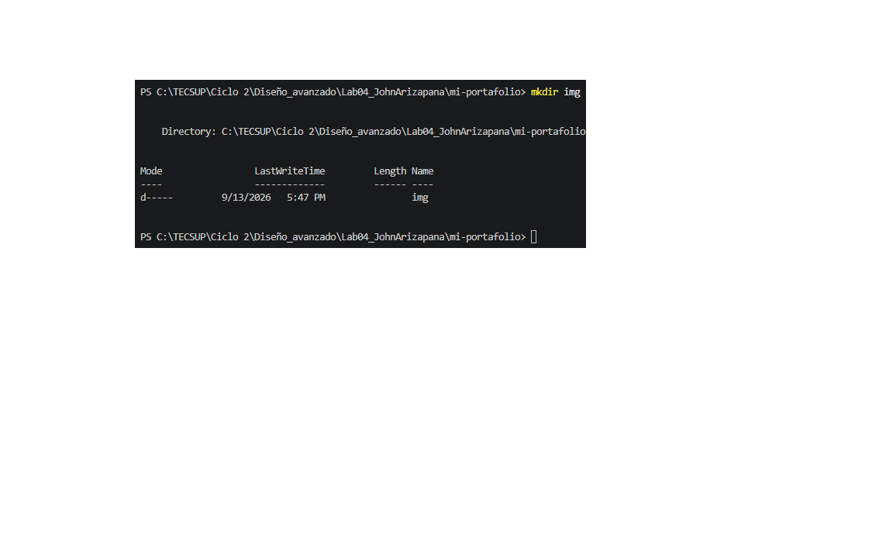

# Guia de Contribucion

Esta documentacion explica detalladamente los pasos para corregir el error visual en el repositorio de la tienda de Tecsup.

## Descripcion del Problema

El proyecto original presentaba un fallo donde la pagina web se renderizaba completamente en blanco y negro con la tipografia por defecto del sistema, rompiendo la experiencia visual establecida.

### Analisis del Error
Al revisar la estructura de archivos, el diseño CSS estaba correctamente codificado dentro de `estilos.css`, pero en el archivo principal `index.html` se estaba invocando de forma erronea mediante la referencia a `estilo.css` (en singular).

## Pasos para la Instalacion y Uso

Para desplegar y trabajar en este proyecto localmente, debes seguir este orden:

- **Forkear** el repositorio original del docente a tu perfil personal en GitHub.
- **Clonar** tu propia copia remota a tu espacio de trabajo local.
- **Probar** la ejecucion inicial abriendo el archivo HTML en un navegador.

### Comandos de Despliegue
1. Actualiza tu rama principal e incorpora cambios del profesor:
   `git switch main`
2. Descarga las modificaciones mas recientes a tu editor:
   `git pull`
3. Crea tu nueva rama de trabajo de forma aislada:
   `git checkout -b fix-ruta-estilos`

## Tareas Pendientes del Modulo

- [x] Identificar el error tipografico en la ruta del link HTML
- [x] Crear una rama descriptiva aislada de la rama main
- [ ] Validar la integracion final del Pull Request por el docente

## Control de Cambios y Archivos

| Archivo Modificado | Tipo de Cambio | Herramienta de Edicion |
|--------------------|----------------|------------------------|
| index.html         | Correccion de tag link | Visual Studio Code |
| script.js          | Sin modificaciones | Analisis de codigo |
| estilos.css        | Sin modificaciones | Verificacion de estilos |

## Resolucion del Error en Codigo

Para solucionar el problema, debes modificar la linea de importacion del estilo css reemplazando la ruta antigua por la correcta:

```html
<!-- Linea corregida dentro del head en index.html -->
<link rel="stylesheet" href="estilos.css">
```

## Recursos de Soporte

- [Documentacion oficial de Git](https://git-scm.com)
- [Mi Perfil en GitHub](https://github.com/johnarizapana)

## Captura de Verificacion



- [Guia del proyecto](docs/GUIA.md)

